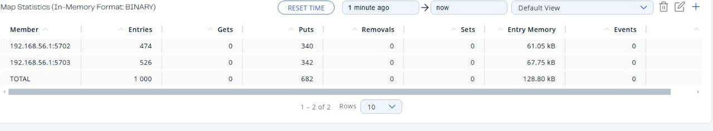
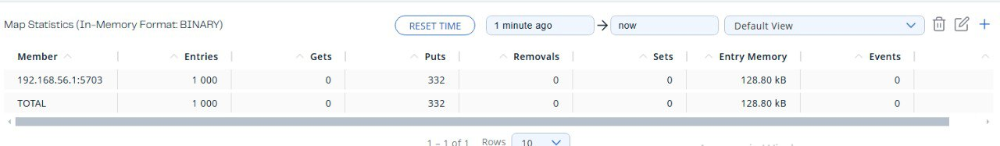
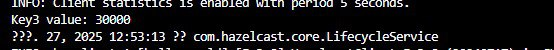

# Hazelcast

1. Після налаштування hazelcast

2. Запущені 3 ноди:

ці три ноди у management center:

3. запит клієнта на створення distributed map,

створена distributed map, 1000 entries:

Розподіл entries по нодах:

Вимикаємо першу ноду:

Як змінився розподіл по нодах після вимкнення першої ноди:

Вимикаємо другу ноду:

Лишається одна:

Розподіл entries після цього:

Результат якщо вимикати дві ноди одночасно (програмно):

Висновок - втрати даних не буде, якщо працює хоч одна нода, якщо треба, дані не втрачались при падінні усіх серверів, для hazelcast треба задати persistance.

4. Після роботи з distributed map, збільшення значення "key" трьома клієнтами паралельно 10000 разів, значення ключа "key"

5. Доступ з pessimistic locks, значення ключа 30000, однак працює довго:

Час виконання:

6. Доступ з optimistic locks:

Час виконання:

7. Порівняння:

Для доступу без блокування при паралельно запущених клієнтах справді зустрічається втрата даних через race condition.

Реалізація з песимістичним блокування набагато надійніша, але в 4 рази повільніша ніж реалізація з оптимістичним блокуванням.

Песимістичне блокування краще задіювати, коли доступ до даних справді частий, очікується, що часто виникатиме конфлікт і потрібно забезпечити цілісність даних. Якщо конфлікти не очікуються часто, і latency важливіше - кращим варіантом буде optimistic locking

8. Робота із bounded queue:

Без consumer-а, програма просто зависає, бо черга обмежена, producer не може додати нових даних в чергу

